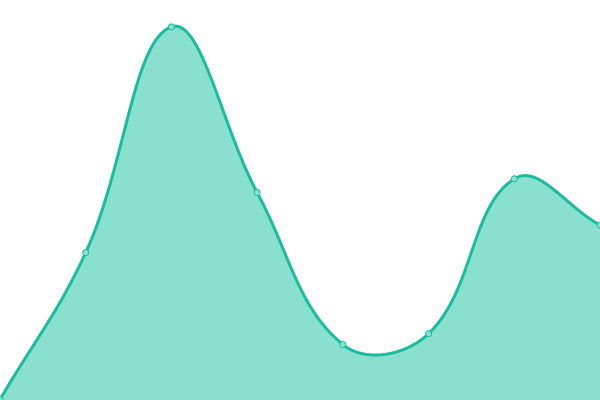
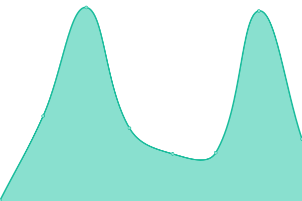

# [📈 Live Status](https://status.samj.net): <!--live status--> **🟩 All systems operational**

This repository contains the open-source uptime monitor and status page for [Sam Johnston](http://samjohnston.org/), powered by [Upptime](https://github.com/upptime/upptime).

With [Upptime](https://upptime.js.org), you can get your own unlimited and free uptime monitor and status page, powered entirely by a GitHub repository. We use [Issues](https://github.com/samj/status/issues) as incident reports, [Actions](https://github.com/samj/status/actions) as uptime monitors, and [Pages](https://status.samj.net) for the status page.

<!--start: status pages-->
<!-- This summary is generated by Upptime (https://github.com/upptime/upptime) -->
<!-- Do not edit this manually, your changes will be overwritten -->
<!-- prettier-ignore -->
| URL | Status | History | Response Time | Uptime |
| --- | ------ | ------- | ------------- | ------ |
|  [Github](https://www.github.com) | 🟩 Up | [github.yml](https://github.com/samj/status/commits/HEAD/history/github.yml) | 

 360ms
     
 | 

<a href="https://status.samj.net/history/github">100.00%</a>
    

|  [Sam Johnston](https://samjohnston.org) | 🟩 Up | [sam-johnston.yml](https://github.com/samj/status/commits/HEAD/history/sam-johnston.yml) | 

 2814ms
     
 | 

<a href="https://status.samj.net/history/sam-johnston">96.66%</a>
    

|  [pAI-OS](https://paios.org) | 🟩 Up | [p-ai-os.yml](https://github.com/samj/status/commits/HEAD/history/p-ai-os.yml) | 

 323ms
     
 | 

<a href="https://status.samj.net/history/p-ai-os">100.00%</a>
    

|  Frankfurt | 🟩 Up | [frankfurt.yml](https://github.com/samj/status/commits/HEAD/history/frankfurt.yml) | 

 126ms
     
 | 

<a href="https://status.samj.net/history/frankfurt">100.00%</a>
    

|  London | 🟩 Up | [london.yml](https://github.com/samj/status/commits/HEAD/history/london.yml) | 

 114ms
     
 | 

<a href="https://status.samj.net/history/london">100.00%</a>
    

|  New York | 🟩 Up | [new-york.yml](https://github.com/samj/status/commits/HEAD/history/new-york.yml) | 

 43ms
     
 | 

<a href="https://status.samj.net/history/new-york">100.00%</a>
    

<!--end: status pages-->

[**Visit our status website →**](https://status.samj.net)

## 📄 License

- Powered by: [Upptime](https://github.com/upptime/upptime)
- Code: [MIT](./LICENSE) © [Anand Chowdhary](https://anandchowdhary.com), supported by [Pabio](https://pabio.com)
- Data in the `./history` directory: [Open Database License](https://opendatacommons.org/licenses/odbl/1-0/)
